# Extraction Shooter Map Design Whitepaper：搜打撤地图与关卡设计专业白皮书
> 语言 / Language：中文 | [English](README.en.md)
>
> 一句话：一份面向研发团队的搜打撤 / 撤离射击地图设计白皮书，覆盖拓扑、POI、风险收益、PvPvE、撤离压力与遥测指标。
>
> 适合谁：FPS / PvPvE 项目组、关卡策划、系统策划、数值策划、制作人、游戏设计研究者。
>
> 阅读价值：它不是单篇观点文，而是一套可以拿去开评审会的地图设计框架，包含原创案例地图、检查表、指标建议和生产管线。
>
> 作者：魔魔王；版本：v1.0；发布日期：2026-06-13。
>
> 阅读入口：此页为完整报告；轻量索引见 [INDEX.md](INDEX.md)，中文正文源文件见 [报告.md](报告.md)。

## 关键结论

- 搜打撤地图不是竞技场，也不是风景容器，而是把损失、收益、时间和信息压到同一局里的风险系统。
- 拓扑、POI、出生点、撤离点和 PvE 不能分开评审；任一层失衡，都会改变玩家对收益和死亡的归因。
- 允许埋伏不等于允许无成本蹲点。好的地图会让埋伏付出时间、信息、弹药或撤离窗口成本。
- “边境工业隔离区”是原创方法案例，不是已验证量产地图；进入项目生产前需要灰盒测试和遥测校准。

面向研发团队的地图、关卡、系统、数值与运营协作文档

版本：v1.0  
案例地图：边境工业隔离区  
适用阶段：立项评审、纸面设计、灰盒验证、白盒联调、封测调优、赛季迭代

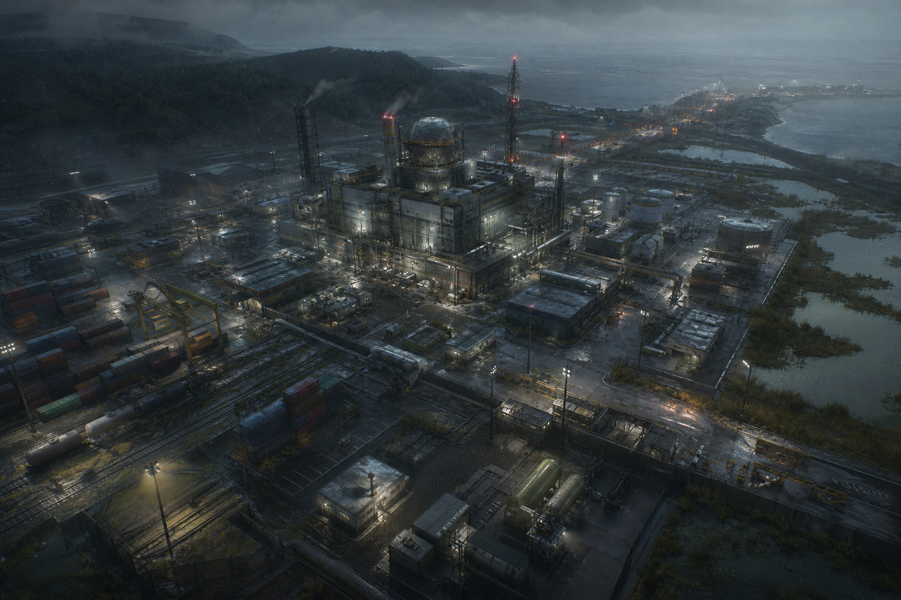

## 摘要

搜打撤的地图不是传统多人射击中的竞技场，也不是开放世界中的风景容器。它更接近一台“风险收益机器”：玩家带着可损失的装备进入地图，在有限信息下搜索资源、判断路线、选择是否交战，并在撤离成功时兑现收益，在死亡或超时撤离失败时承担损失。地图与关卡设计的核心任务，是把这种循环组织成可学习、可复盘、可博弈、可长期运营的空间系统。

在这个品类里，玩家的每一次移动都隐含了经济意义。走主路可能更快抵达高价值区，但会被更多玩家观察；绕外圈可能更安全，但时间会被消耗，资源上限也较低；进入核心 POI 能获得高价值物资，却会暴露位置、消耗弹药、吸引第三方；撤离点既是安全承诺，也是末局冲突的天然诱因。因此，地图设计不能只讨论“好不好看”或“路线多不多”，而要同时讨论搜索效率、遭遇概率、声音传播、AI 压力、撤离可靠性、收益密度、出生公平性与玩家学习曲线。

本白皮书把搜打撤地图拆解为八个层级：品类循环、宏观拓扑、风险收益热区、出生撤离矩阵、POI 关卡单元、交战距离与掩体、PvPvE 编排、生产与遥测闭环。文档以原创地图“边境工业隔离区”为贯穿案例，提供可落地的设计原则、检查表、指标建议和迭代方法，目标是帮助研发团队在纸面阶段减少结构性错误，在灰盒阶段快速发现路线问题，在封测阶段用数据判断地图健康度。

## 一、品类循环：地图为什么是搜打撤的核心系统

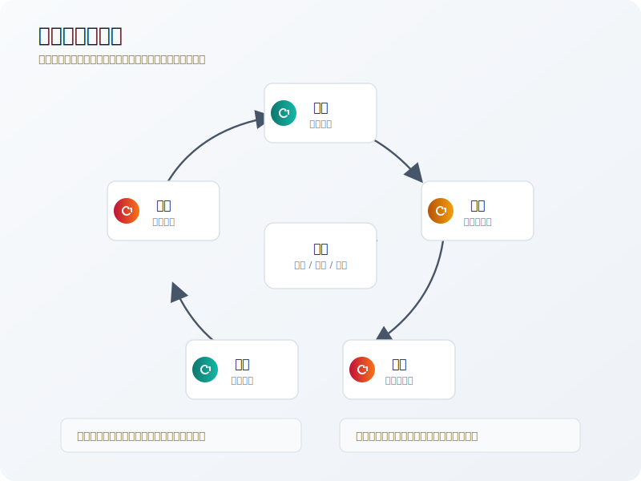

搜打撤的核心循环可以概括为六个动作：进入、搜索、交战、抉择、撤离、损失与成长。传统团队竞技射击的地图通常服务于“公平对抗”，战局目标明确，复活或回合重开会降低单次死亡的经济重量。搜打撤则不同，它把玩家带入一种持续的风险账户。玩家不是只在地图上移动，而是在用自己的装备、时间、情报和心理承受力下注。

地图在这个循环中承担四种职责。

第一，地图提供收益目标。收益目标包括高价值物资、任务道具、Boss 掉落、保险箱、钥匙房、稀有材料、玩家尸体、信息点位和撤离奖励。没有收益目标，玩家只会把地图当作竞技场；收益过于集中，玩家又会被迫重复冲向同一个热区。好的搜打撤地图会把收益做成层级：低风险区域提供基础补给，中风险区域提供稳定收益，高风险区域提供高上限和强叙事记忆。

第二，地图制造不完全信息。玩家需要知道大方向，但不能掌握所有状态。附近是否有人、Boss 是否被击杀、某个撤离点是否可用、高价值房间是否已被搜刮、远处枪声意味着战斗还是诱饵，这些信息应当通过声音、地标、环境变化、任务反馈、AI 状态和玩家经验逐步揭示。信息过少会变成迷路和沮丧，信息过多会让撤离风险失去张力。

第三，地图安排冲突概率。搜打撤不是要求每局必定高强度交火，而是要求玩家相信冲突随时可能发生。地图要让玩家理解某些区域“可能有人”，某些路线“可能被架”，某些事件“会吸引人”，但不能让所有移动都变成无意义的随机死亡。冲突概率的设计重点不是平均分布，而是让玩家能通过路线、时间、声音、装备和目标选择主动调节风险。

第四，地图提供撤离承诺。撤离点是搜打撤区别于普通生存射击的重要空间结构。它让玩家的贪婪有终点，也让玩家的恐惧有出口。撤离点必须可靠到足以让玩家制定计划，又必须危险到不能被视为免费结算按钮。它既是安全系统，也是末局交战系统。

因此，搜打撤地图的专业设计目标可以写成一句话：让玩家在可理解的空间里持续面对“更贪一点还是现在走”的决策，并让每种选择都能被地图、系统和经济共同兑现。

## 二、宏观地图结构：拓扑先于美术，路径先于故事

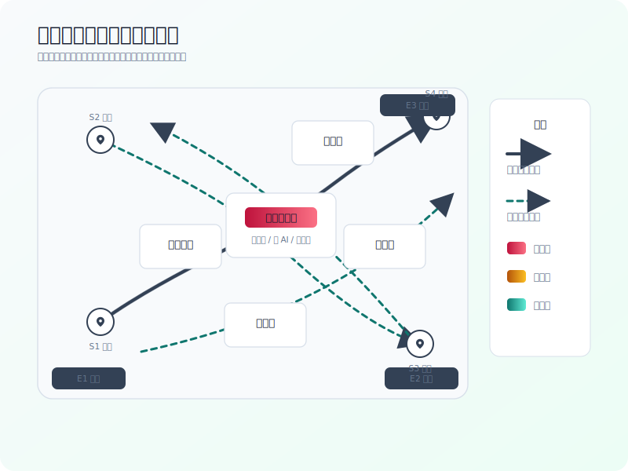

宏观地图设计的第一步不是画漂亮地形，而是确定拓扑关系。拓扑指的是点与点之间的连接方式、路径代价和冲突关系。一个搜打撤地图至少包含以下节点：出生点、低风险补给点、中风险资源点、高价值热区、任务点、AI 占区、条件开关、撤离点、绕行通道、观察高地和声音事件源。美术主题可以改变这些节点的表现形式，但不能替代它们的系统功能。

以“边境工业隔离区”为例，地图采用近未来边境工业题材，核心区域是被封锁的实验厂，外圈由铁路仓库、宿舍区、行政楼、污水站、码头和湿地组成。它的结构目标不是让所有玩家都冲向实验厂，而是形成三类主要路线。

第一类是高速高风险路线。玩家从出生点快速进入主干道路，沿集装箱场、铁路桥或厂区正门抵达核心实验厂。这条路线时间短，收益上限高，但声音暴露明显，早期遭遇概率高，撤离时容易被追击。它适合高装备玩家、组队玩家和任务明确的老手。

第二类是中速可控路线。玩家先搜索铁路仓库、行政楼或污水站，获得补给、钥匙、情报或任务道具，再决定是否进入核心区域。这类路线提供阶段性决策点，能让玩家在前中期判断“继续深入”还是“带着已有收益撤离”。它是地图健康度的关键，因为多数玩家不应被迫在开局几分钟内完成唯一正确选择。

第三类是低速保守路线。玩家沿湿地、宿舍区、外圈维修道移动，收益较低，但能避开核心枪线，并在中后局寻找尸体、遗留物资或低冲突撤离。它服务新手、低装备玩家、单排玩家和任务型玩家。低速路线不是“新手保护区”，而是风险调节器。它让弱势玩家有参与空间，也让强势玩家在追击时付出时间代价。

宏观拓扑设计最容易犯三个错误。

第一，中心单核化。所有高价值物资、任务目标和 Boss 都放在地图中心，导致玩家路线高度重复，战局前十分钟过度拥挤，后半局空洞。中心单核不是绝对不能用，但必须配套外圈收益、条件入口、延迟事件或可替代目标，否则地图会迅速被老手解构成固定冲刺路线。

第二，外圈无意义。很多地图会画出大量边缘区域，但这些区域没有可持续收益、没有任务、没有可观察地标，也没有通往热区的战术价值。玩家一旦学习到外圈只是浪费时间，就会永远放弃它。外圈应当至少承担补给、绕行、撤退、伏击、任务采集或低风险教学中的一项。

第三，撤离点与高价值点关系过近。若核心热区旁边存在稳定撤离点，高装备玩家会形成“冲热区、拿货、立刻走”的高速刷钱线，降低地图中后局活跃度。若撤离点过远且路线单一，玩家又会感到成功主要取决于被不被架。撤离点应与高价值区保持一定空间距离，并通过多条不同风险路径连接。

宏观结构验收可以用五个问题完成：每个出生点是否至少有两条合理早期路线；每个高价值点是否至少有三个进入方向；每条撤离路线是否存在可识别的风险段；外圈是否提供真实收益或战术价值；玩家是否能在中局找到新的目标，而不是只剩撤离或扫图。

## 三、风险收益热区：让价值形成压力场

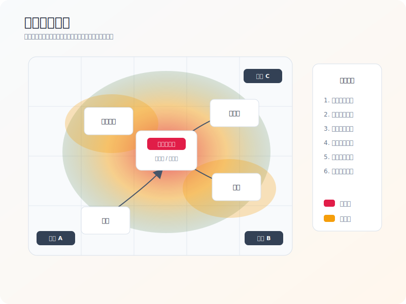

搜打撤地图中的价值不能只按“房间里放多少稀有物资”来理解。真正影响玩家行为的是风险收益热区。热区是一组综合信号：高价值物资、任务目标、AI 强度、声音事件、路线交叉、撤离距离、可被观察程度和玩家预期。玩家愿不愿意进入某个区域，取决于这些信号叠加后的心理收益。

健康的风险收益结构应当有三个层次。

低风险低收益层提供基础节奏。它位于出生点附近、外圈路线或撤离路径周边，主要产出医疗、弹药、普通材料、低级任务道具和环境信息。它的作用不是让玩家暴富，而是让玩家有启动空间。新手需要通过这些区域学习地标和路线，老手也需要在装备不足、受伤或弹药短缺时获得恢复机会。

中风险稳定收益层提供地图主体。它通常由仓库、宿舍、行政楼、小型军事据点、维修站、检查站等构成。这些区域不一定有最高价值，但收益稳定、路线多样、遭遇概率适中。中风险层是搜打撤地图的“可持续内容”，因为它决定了非顶级玩家是否有足够多的选择。

高风险高收益层提供记忆点。它可以是实验厂、地下金库、Boss 巢穴、信号塔控制室、封锁医院或大型军火库。它需要强地标、强叙事、强收益和强代价。高风险层不应只靠“多刷稀有物资”驱动，还应通过进入条件、噪声暴露、AI 防御、空间压迫、撤离距离或竞争任务来制造代价。

热区设计必须避免“隐性不公平”。如果玩家看不出某个区域为什么危险，他们会把死亡归因于地图恶意。如果玩家看得出危险但仍选择进入，死亡就会变成可复盘的代价。视觉地标、破损痕迹、灯光、警报、AI 密度、远处枪声、尸体分布和入口复杂度都可以传达风险等级。

在“边境工业隔离区”中，核心实验厂是最高热区。它的红区不只覆盖建筑内部，还延伸到入口道路、楼顶观察点、供电站和撤离必经的外场。铁路仓库与码头是黄区，提供稳定收益并连接主路线。宿舍区和湿地是绿区，提供医疗、低级材料和绕行空间。这样的热区关系能形成三个阶段：开局玩家从绿区或黄区启动，中局向红区或黄区汇聚，后局从红区向撤离点扩散。

风险收益调优不应只看物资价值，还应同时记录平均停留时间、开局五分钟进入率、区域死亡率、撤离成功后的区域访问组合、玩家背包价值曲线和队伍规模差异。如果某个区域访问率高但撤离成功率极低，可能是它过度惩罚；如果某个区域访问率低但成功收益很高，可能是它缺少信息引导；如果某条路线收益高且死亡率低，可能会形成刷钱路线。

## 四、出生点与撤离点：公平不是等距，而是可选择

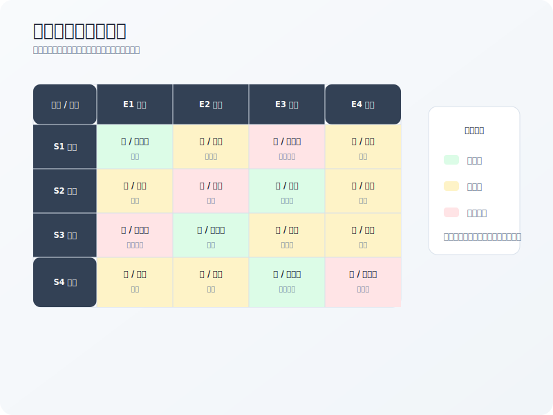

出生点决定玩家开局信息、路线选择和早期遭遇概率。撤离点决定玩家的收益兑现方式和末局压力。两者之间的关系，往往比单个 POI 设计更容易造成地图结构性问题。

很多团队会用“出生点到中心距离差不多”来判断公平，但搜打撤的公平更复杂。一个出生点可能离中心较远，但附近有稳定补给和低风险撤离，因此适合保守打法；另一个出生点可能离高价值点很近，但缺少掩体且早期会被多个出生点夹击，实际风险更高。公平不是所有出生点完全相同，而是每个出生点都应拥有可解释的优势、劣势和至少两种可行开局。

出生点设计应遵守六条原则。

第一，避免出生即互架。玩家在开局十到二十秒内不应被其他出生点直接架住，除非游戏明确追求高压硬核体验，并且提供强提示或遮蔽物。搜打撤的开局死亡成本高，出生点互架会破坏玩家对地图的信任。

第二，避免唯一最优路线。若某个出生点天然对应一条最短高价值路线，玩家会在几局内形成固定跑法，其他选择失效。应通过门禁、噪声、AI、地形暴露、时间成本或资源稀缺打散唯一最优。

第三，保证弱势开局有保底。弱势出生点可以离热区远，但附近应有低风险补给、任务点或安全转移路线。保底不意味着免费收益，而是保证玩家不因出生随机性失去参与权。

第四，撤离点不能完全对称。完全对称的撤离点虽然看似公平，但容易缺少叙事和战术差异。更好的做法是设置普通撤离、条件撤离、一次性撤离、付费撤离、道具撤离、事件撤离等多种类型，并让不同出生点面对不同撤离规划。

第五，撤离点必须有反蹲点设计。反蹲点不是取消埋伏，而是让埋伏者付出代价。撤离区周边应有多入口、多视线遮蔽、替代路线、倒计时暴露、AI 巡逻、声音信号或可消耗道具。埋伏可以存在，但不能成为低成本稳定收益。

第六，出生撤离关系需要矩阵化检查。设计阶段应列出每个出生点到每个撤离点的距离、主路线数量、暴露段长度、经过热区数量、撤离条件和平均到达时间。矩阵中出现“近、高收益、低暴露、稳定可用”的组合时，必须额外限制；出现“远、低收益、高暴露、无替代”的组合时，必须补偿。

在“边境工业隔离区”里，西南出生点靠近公路撤离，适合保底撤离，但去实验厂需要穿越集装箱主路；西北出生点接近铁路仓库，早期收益稳定，但去码头撤离会穿越热区；东南出生点接近码头撤离和污水站，撤离可靠但容易被码头高台观察；东北出生点接近山口撤离，路线安全但物资启动较弱。这样的非对称关系可以形成不同开局性格，而不是把出生点做成只差坐标的复制品。

## 五、POI 关卡单元：每个高价值点都要有进入剧本

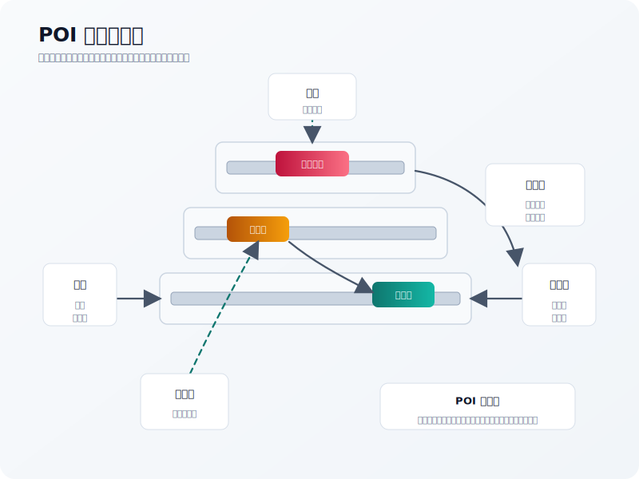

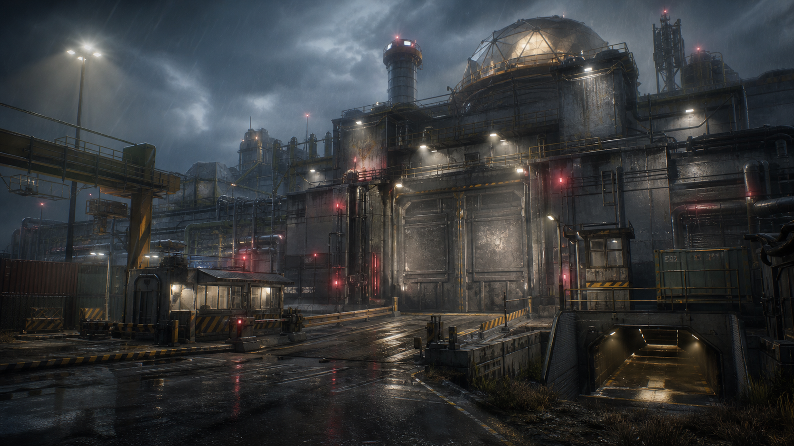

POI 是搜打撤地图的关卡单位。玩家对地图的记忆往往不是“我在坐标 430,250 死了”，而是“我在实验厂二楼电力间被侧门进来的人打了”。因此，POI 设计决定了玩家是否能形成可复盘的空间经验。

一个成熟 POI 至少要回答八个问题：它为什么值得来；玩家从哪里进入；进入前能观察到什么；进入后会暴露什么；内部如何搜索；交战如何展开；失败时如何撤退；成功后如何离开。

多入口是高价值 POI 的基本要求，但多入口不等于多开几扇门。不同入口必须有差异。

正门通常最快、最直观、最容易被架。它适合高装备玩家快速突破，也适合让新手理解建筑方向。正门不应过窄，否则会变成单向绞肉机；也不应过安全，否则会成为唯一入口。

侧门通常连接绕行路线。它应提供较低暴露或更接近特定资源点的优势，但可能需要更长路径、更复杂导航或额外声音代价。侧门是让弱势队伍绕开正面火力的重要工具。

垂直入口包括天窗、楼梯井、屋顶、地下管道、电梯井和破损墙洞。垂直入口能显著提升 POI 的战术深度，但必须控制信息不对称。上方玩家若同时拥有视野、掩体和撤退优势，低位玩家会感到无解。垂直入口应配套声音、动画前摇、可破坏物或反制路线。

噪声入口包括铁门、卷帘门、玻璃、报警器、电闸、机关门和水面通道。它们的价值在于把“进入”变成信息事件。玩家可以选择快进，但要告诉周围的人自己来了。噪声入口特别适合连接高价值房间，因为它能让收益兑现前先产生风险。

撤退口不是入口的附属品，而是 POI 体验的关键。搜打撤玩家在拿到收益后，心理状态会从进攻变成保全。POI 若只有进入路线没有撤退路线，成功玩家会被迫原路返回，降低空间策略。撤退口可以更窄、更危险、更难发现，但不能完全缺失。

POI 内部空间应避免两种极端。一种是纯迷宫，玩家不断在相似走廊和房间中迷失，死亡无法复盘。另一种是纯大厅，所有战斗都由远距离视线决定，搜索没有张力。更合适的结构是“可识别主轴 + 局部复杂房间 + 多个短循环”。主轴帮助方向感，复杂房间提供搜索和埋伏，短循环让玩家能绕到敌人侧面或撤退。

高价值房间要有“进入剧本”。例如实验厂核心库房可以有三种进入方式：正门需要刷卡且会触发警报；二楼天窗需要从屋顶进入但暴露在狙击视线中；地下管道可以绕入但水声明显且撤退慢。三种方式都能到达同一目标，但对应不同队伍风格和装备准备。

## 六、视线、掩体与交战距离：让枪械生态在空间中成立

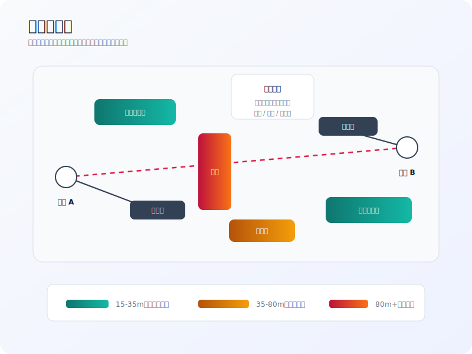

搜打撤地图中的交战距离不应只由枪械数值决定。地图如果全是长直道路，狙击和高倍镜会统治体验；如果全是室内短巷，冲锋枪、霰弹枪和投掷物会过强；如果掩体分布随机，玩家会把死亡归因于运气。关卡需要主动塑造不同距离段的战斗生态。

可以把交战距离粗略分为四类。

近距离 0 到 15 米，主要发生在房间、楼梯、门口、集装箱夹缝和地下通道。它强调声音判断、预瞄、投掷物、开门动作和快速反应。近距离区域适合高价值房间入口、狭窄撤退口和高压搜索空间，但不能连续覆盖过大范围，否则队伍人数优势会被放大，单排玩家更难生存。

中近距离 15 到 35 米，是搜打撤最常用的交战段之一。它允许冲锋枪、步枪、霰弹枪、半自动武器都有参与空间，也允许玩家利用掩体进行位移。仓库、庭院、宿舍楼间距、管廊和小型街区都适合这个距离段。

中远距离 35 到 80 米，适合步枪压制、观察与转移。这个距离段能让玩家感到地图开阔，但仍有机会通过掩体、烟雾、路线选择和撤退做反应。工业园道路、铁路场、码头堆场和山坡边缘可以使用这个距离段。

远距离 80 米以上，适合狙击、侦察和区域威慑。远距离视线要谨慎使用，尤其不能连续覆盖出生点、撤离点和主干路线。长视线必须被代价抵消，例如射手位置暴露、撤退困难、补给稀缺、视线受天气影响或需要放弃高价值搜索时间。

掩体也要分层。硬掩体能挡子弹，提供稳定战斗节奏；软遮蔽能挡视线但不一定挡伤害，制造信息不确定；半身掩体提供姿态选择；可穿透掩体增加知识差；可破坏掩体提供动态变化。不同掩体的视觉语言必须清晰，玩家需要能在高压下判断“这里能不能救命”。

搜打撤特别需要“撤退掩体”。传统竞技地图更关注进攻路线和交火点，而搜打撤玩家常常在拿到收益后选择撤退。撤退路线若没有间歇掩体，玩家会被长视线无解追杀；撤退路线若掩体过密，追击者又缺少机会。合理做法是设置节奏性掩体：每 15 到 30 米给一次短暂停顿，但在关键转角或开阔段制造暴露窗口。

声音是视线的另一半。工业地图中的金属踏板、碎玻璃、水坑、铁门、警报、电梯、闸机和发电机都能成为关卡机制。声音材料不只是氛围，它能改变玩家路径选择。若某条捷径必然踩过铁皮屋顶，玩家选择它时就理解了代价。若某个高价值房间开启时全区广播，战斗就不再是随机遭遇，而是围绕信息事件展开。

## 七、PvPvE 编排：AI 不是填充物，而是风险节奏器

搜打撤的 PvPvE 不是简单地在地图上放一些敌人。AI 的作用至少有五种：守护收益、制造声音、消耗资源、暴露玩家、改变路线。AI 如果只会站在物资箱旁边等玩家清理，它很快会变成刷钱流程；如果 AI 精度过高、数量过多、刷新过频，则会压垮 PvP 判断，让玩家觉得主要在和系统作战。

AI 占区应服务地图层级。低风险区可以放少量弱 AI，用来教学声音、索敌和基础战斗。中风险区可以放巡逻 AI 或小队 AI，让玩家需要清理或绕行。高风险区可以放精英 AI、Boss、炮塔、无人机、警报系统或增援机制，迫使玩家在进入前做好准备。

Boss 设计尤其要和地图结构绑定。Boss 不应只是一个高血量敌人，而应是区域事件的核心。它可以改变门禁、触发广播、开启特殊撤离、掉落钥匙、吸引 AI 增援或改变局部电力。Boss 被击杀后的信息应该以某种方式被其他玩家感知，形成第三方争夺。公开资料中，Hunt: Showdown 的赏金和线索机制就体现了“目标推进会改变全局信息”的设计思路；玩家通过线索缩小目标范围，拾取赏金后也会暴露自身压力。搜打撤项目未必照搬这个机制，但应学习它把 PvE 目标、地图信息和玩家冲突绑定在一起的方式。

AI 的声音价值常常被低估。一个玩家开枪清 AI，不只是消耗弹药，也是在告诉周围玩家自己大致位置、武器类型、交战方向和风险状态。AI 如果能迫使玩家发声，就能把地图从静态空间变成信息网络。反过来，如果大量 AI 被消音武器无成本处理，或者 AI 与玩家战斗声音无法传播，PvPvE 的联动价值就会下降。

AI 刷新要谨慎。搜打撤强调可学习性，玩家需要相信某些区域大概率有什么威胁。完全随机刷 AI 会降低复盘价值；完全固定刷 AI 又会被刷路线脚本化。较好的方式是“固定区域 + 随机组合 + 条件增援”。例如核心实验厂总是有防御力量，但具体巡逻路线、精英单位位置和增援触发条件会变化。

AI 与撤离点的关系也值得设计。撤离区可以有少量巡逻 AI 防止长期蹲守，也可以在高价值事件后刷新搜捕队，迫使携带高价值物资的玩家加速决策。但撤离 AI 不能强到替代玩家威胁，否则玩家会觉得撤离失败主要来自系统惩罚。

## 八、搜索与经济分布：让物资变成路线语言

搜打撤的物资分布不是数值表的末端执行，而是地图设计的核心语言。玩家通过物资学习地图：哪里适合补医疗，哪里适合找枪械配件，哪里可能刷任务道具，哪里值得用钥匙，哪里已经被搜过。物资分布决定了玩家是否会反复探索地图，还是只记住几个高价值箱子。

物资应按“稳定性”和“上限”区分。稳定收益适合中低风险区域，帮助玩家形成可靠路线；高上限收益适合高风险区域，用来制造争夺和情绪峰值。稳定收益不必很高，但要让玩家觉得时间没有浪费。高上限收益不必每局出现，但出现时要足以改变玩家决策。

任务道具与经济物资要分离但有关联。若所有任务都要求进入最高热区，新手和低装备玩家会被迫进入高压环境；若所有任务都在外圈完成，任务玩家会脱离 PvP 主体。更合理的做法是让任务链逐步引导：早期任务学习外圈和撤离，中期任务进入中风险区，后期任务触及核心热区。任务道具可以让玩家理解路线，而不是只作为清单收集物。

钥匙房和保险箱是典型的风险收益放大器。它们不应只是高价值箱子的皮肤，而应带来准备成本、路线选择和声音代价。钥匙可能占用背包或保险空间，开门可能触发声音，房间可能缺少安全撤退口，或者需要先在地图另一处开启电力。这样钥匙房才会从“刷钱点”变成“计划目标”。

物资容器的可读性很重要。玩家应当能根据容器类型、区域主题和环境叙事推测物资类别。医疗柜出医疗，军械箱出武器配件，办公室出情报和电子材料，宿舍出生活物资，实验厂出稀有样本。完全随机的物资表会削弱地图学习；过度固定又会让路线僵化。推荐采用“类别稳定、品质浮动、少量惊喜”的原则。

经济分布还要考虑组队差异。三人队清理高风险区的能力更强，也能携带更多战利品。如果高价值物资集中且可被快速搬空，组队优势会进一步放大。应通过重量、容器开启时间、多个分散目标、条件撤离、噪声事件和任务互斥来缓解单点搬空问题。单排玩家不需要和三人队收益完全相同，但应有适合单排的低噪声、高判断路线。

地图经济的关键指标包括：单位时间平均带出价值、区域访问后的撤离成功率、不同队伍规模的收益差距、钥匙房开启率、高价值物资流向、玩家死亡时背包价值、保底区域访问率、空手撤离率和低装备玩家连续失败率。若经济数据只看全局平均，很容易掩盖某些路线过强或某些玩家层级被压垮。

## 九、信息、导航与学习曲线：硬核不等于不告诉玩家

搜打撤玩家可以接受风险，但难以长期接受不可学习的混乱。地图越硬核，越需要可靠的信息设计。导航不是把所有目标都标在 UI 上，而是让玩家通过地标、路线、声音、建筑语言和任务文本建立空间模型。

地标设计应分为三层。远景地标用于大方向判断，例如实验厂烟囱、雷达塔、山口灯塔、港口吊机。中景地标用于路线选择，例如铁路桥、红色仓库、污水处理池、宿舍楼群。近景地标用于局部战斗，例如破损楼梯、蓝色铁门、发电机房、坍塌墙洞。三层地标共同帮助玩家从“我在哪里”过渡到“我该怎么走”和“敌人可能从哪里来”。

地图 UI 的强度要与项目定位一致。硬核项目可以不显示玩家实时位置，但仍应提供高质量纸质地图、撤离点名称、地标一致性和任务文本。偏大众化项目可以提供简化地图、方向提示、撤离条件提示和队友标记。无论选择哪种强度，都要避免信息规则不一致。玩家可以不知道一切，但必须知道系统在按什么规则隐藏信息。

撤离提示尤其重要。撤离点可以有条件，但条件必须可理解。比如“需要开启污水站电闸”“需要携带边境通行证”“只在倒计时 20 分钟后开放”“一次性载具撤离”。如果撤离失败原因不清楚，玩家会把失败归因于 Bug 或恶意设计。撤离点的视觉、声音和 UI 反馈都要明确。

黑箱学习成本需要控制。搜打撤的魅力之一是玩家会通过死亡学习地图，但不是所有知识都适合通过死亡教学。哪些窗户能翻、哪些栅栏能穿、哪些水域会减速、哪些门能打开、哪些墙能穿透，这些规则应有稳定视觉语言。不可预测的交互规则会让地图学习变成记忆负担。

新手引导可以藏在地图中，而不是单独做教程。低风险区应展示基础物资容器、简单 AI、明显撤离点和清晰地标。中风险区展示绕行、噪声入口、钥匙房和交叉路线。高风险区展示复杂垂直、强 AI、公开事件和撤离压力。这样玩家的成长路径就和地图深度自然一致。

## 十、反蹲点与公平性：允许埋伏，但要让埋伏有成本

搜打撤必须允许埋伏。如果完全取消埋伏，撤离的紧张感会下降，信息博弈也会减少。但埋伏不能变成低成本、低风险、高稳定收益的策略。反蹲点设计的目标不是让每个撤离点绝对安全，而是让埋伏者必须投入时间、暴露位置、承担被绕后或被 AI 干扰的风险。

撤离蹲守通常来自四个问题：撤离点入口单一，观察点过强，撤离倒计时期间玩家不可移动，撤离点周边缺少替代路线。修正手段包括增加多入口撤离区、设置短时声音暴露、提供烟雾或遮蔽物、让撤离倒计时可中断、让蹲守位置缺乏补给、加入巡逻 AI、设计反观察路线或设置条件撤离。

出生点蹲守来自早期路线重叠。若两个出生点天然沿同一主路冲向同一资源点，老手会在固定时间点架住对方。解决方案不是简单拉远出生点，而是增加早期路线分叉、遮蔽初始视线、调整资源诱因、让高价值点延迟开放，或让多个出生点拥有不同但等价的早期目标。

热区蹲守来自收益兑现路径过少。玩家拿到高价值物资后，如果只能从同一楼梯、同一门、同一道桥离开，埋伏者就能低成本等待。高价值区的撤退路线应至少有两条不同代价的选择：快但暴露，慢但隐蔽，安全但需要道具，或者危险但能绕开主路。

声音蹲守也需要注意。如果某些材质声音过于明显且无法规避，老手会通过声音长期压制新手。声音应提供信息，但也要给玩家选择。比如水路慢但隐蔽，铁桥快但响，草地安静但视野差，玻璃捷径快但会破碎报警。声音不应只有惩罚，也应成为路线策略。

公平性最终要回到可复盘。玩家死亡后如果能说出“我贪了核心库房，没有检查货梯门，撤离时走了高台视线”，这就是健康失败。玩家如果只能说“我刚出生就被不知道哪里的人秒了”或“撤离点永远有人蹲”，这就是结构问题。

## 十一、撤离阶段压力：时间要调度行为，而不只是结束战局

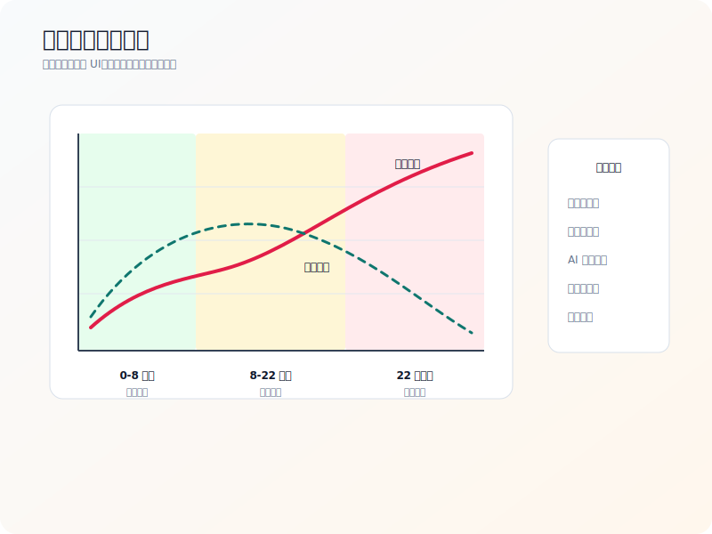

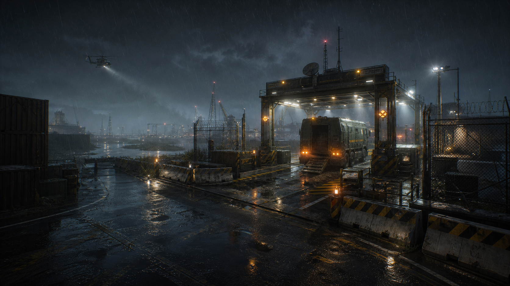

搜打撤的时间系统不能只理解为倒计时。倒计时当然会迫使玩家撤离，但真正专业的地图会让时间改变空间行为。开局、中局和后局应当有不同的路线价值、信息密度和冲突形态。

开局阶段的核心是路线分化。玩家刚出生时装备完整、信息少、收益为零，最常见的行为是快速判断附近目标。这个阶段不宜过度压迫，否则玩家还没形成决策就进入交火。地图应提供清晰地标、附近补给、早期分叉和少量低强度 AI，让玩家能选择冲热区、搜外圈或做任务。

中局阶段的核心是信息扩散。枪声、警报、Boss 状态、被打开的门、被搜过的容器和玩家尸体会逐渐告诉其他玩家地图发生了什么。中局不需要强制所有人相遇，但应通过高价值事件、条件开关和路线交叉让玩家有理由改变原计划。

后局阶段的核心是收益兑现。玩家开始向撤离点移动，背包价值上升，弹药和医疗下降，心理从贪婪转向保全。此时地图可以通过撤离点倒计时、天气变化、AI 巡逻、公开事件或条件撤离关闭来提高压力，但不能让后局变成随机惩罚。压力应当来自玩家可理解的地图规则。

边境工业隔离区的后局设计可以采用暴雨增强和边境巡逻两套轻量事件。暴雨降低远距离视线，抬高近中距离战斗权重；巡逻队压缩完全安全的外圈路线，但不会直接覆盖所有撤离点。这样后局既有变化，又不会否定玩家前期制定的撤离计划。

## 十二、原创案例：边境工业隔离区完整设计草案

边境工业隔离区是一张面向 24 到 36 名玩家、支持单排到三人队的中大型搜打撤地图。单局时长建议为 35 到 45 分钟。地图主题为边境线旁被封锁的工业实验区，一场事故后当地被军事承包商、走私者和拾荒者共同争夺。该设定服务三个设计目的：工业设施提供清晰地标和复杂室内空间；边境线提供撤离与封锁叙事；隔离事故提供 PvE 威胁、稀有样本和动态事件。

地图分为六个主要区域。

核心实验厂是最高价值区，位于地图中部偏北。它包含三层主楼、地下样本库、屋顶通风平台、电力间、警报门和货梯。核心收益包括稀有样本、电子组件、高级医疗、任务文件和 Boss 掉落。主要风险来自强 AI、防御炮塔、警报广播、多入口夹击和撤离距离。

铁路仓库位于西侧中部，是中风险稳定收益区。它提供武器配件、工业材料、任务道具和中距离交战空间。铁路仓库连接西北出生点、西南主干道和实验厂外场。它的功能是让西侧玩家有阶段性目标，而不是被迫直冲中心。

污水站位于东侧中部，是中风险控制区。玩家可以在这里开启部分地下门、关闭某些警报或激活条件撤离。污水站收益不是最高，但具有系统价值，能改变后续路线。它适合让战局围绕“控制权”展开。

宿舍区位于南部，是低到中风险补给区。它提供医疗、食物、低级材料、生活物资和任务采集。宿舍区建筑密度较高，交战距离短，适合新手学习室内搜索和撤退。宿舍区连接公路撤离，是低装备玩家的保底区域。

码头堆场位于东南，是中高风险撤离争夺区。它包含集装箱、吊机、仓库和水路。码头既有稳定物资，也有撤离点，因此容易形成中后局交战。堆场需要大量软遮蔽和多层路线，避免高台单向压制。

湿地与边境外圈位于地图南西和北东边缘，是低风险绕行与侦察区。它收益低，但能避开中心主干线，并提供部分隐藏任务和狙击观察点。湿地移动速度略慢，声音较低，视野受芦苇和雨雾影响。

撤离点包括四类。公路撤离稳定开放，但离核心热区较远；码头撤离需要等待载具，倒计时期间有声音暴露；山口撤离适合北侧玩家，但路线狭窄且容易被观察；条件撤离需要污水站电闸或实验厂通行证，距离高价值区较近但有明确前置成本。

动态事件包括三种。第一是实验厂警报，玩家开启核心样本库时全区听到警报并刷新 AI 增援。第二是边境巡逻，局中后期外圈出现巡逻队，压缩过度安全的边缘路线。第三是暴雨增强，后局雨声变强、远距离视线降低、金属材质声音更突出，使撤离阶段的交战方式发生变化。

这张地图的目标体验可以分成三种玩家故事。

保守玩家从宿舍区或外圈启动，收集基础物资，听到实验厂枪声后绕向铁路仓库捡漏，最后从公路撤离。这个故事提供低装备参与感。

进取玩家开局冲铁路仓库或污水站，拿到钥匙或控制权后进入实验厂，清理核心库房，触发警报，带着高价值物资转向码头或条件撤离。这个故事提供高压收益峰值。

猎人玩家不急于搜索，而是根据枪声和警报判断其他队伍路线，在中局伏击从实验厂撤出的玩家，随后选择是否冒险搜尸或快速撤离。这个故事提供 PvP 信息博弈。

如果三种故事都能在同一张地图上成立，说明地图不只是一个空间，而是一个可反复生成不同局势的系统。

## 十三、生产方法：从灰盒到遥测的闭环

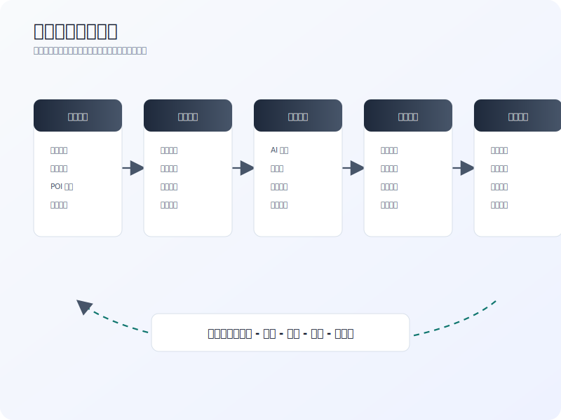

搜打撤地图生产不适合先做高精美术再调玩法。原因很直接：路径、视线、撤离、物资和 AI 的耦合太强，一旦美术资产先定型，后续修改成本会极高。推荐采用五阶段管线：纸面设计、灰盒验证、白盒联调、封测遥测、运营迭代。

纸面设计阶段输出地图拓扑、区域定位、出生撤离矩阵、POI 层级、风险收益假设和关键玩家故事。这个阶段不要沉迷细节房间，而要确认地图是否有足够多的有效路线和阶段性选择。

灰盒验证阶段使用简单几何体搭建地图，重点测试路线时长、视线长度、掩体节奏、出生冲突、撤离蹲点和 POI 多入口。灰盒阶段的目标不是好看，而是快速推翻错误假设。每次测试都应记录玩家开局路线、首次遭遇时间、首次死亡位置、撤离路线和主观迷路点。

白盒联调阶段加入基础美术、AI、物资、任务、音频、交互门、撤离逻辑和性能预算。这个阶段要特别关注系统之间的互相放大。例如某个高价值房间可能在无 AI 时合理，但加上警报和 Boss 后过度惩罚；某条路线在无物资时没人走，但放入任务道具后会造成出生冲突。

封测遥测阶段需要建立地图健康指标。建议至少记录：区域访问率、区域死亡率、平均首次遭遇时间、撤离成功率、不同撤离点使用率、玩家带出价值、死亡时背包价值、队伍规模收益差、Boss 击杀后撤离率、钥匙房开启率、出生点存活率、撤离点附近击杀率、玩家停留热力图和路线流量。

运营迭代阶段不要只调物资价值。很多经济问题本质是路线问题，很多战斗问题本质是视线问题，很多新手流失本质是导航问题。迭代应优先判断问题类型：如果某区收益高且死亡低，可能需要增加暴露、延长撤离距离或降低刷新；如果某区死亡高且收益低，可能需要补掩体、增加替代路线或提高收益；如果某撤离点击杀率异常高，可能需要增加反蹲路线、调整倒计时或改变观察点。

## 十四、专业验收清单

以下清单可用于评审会议、灰盒里程碑和封测复盘。

宏观结构检查：

| 检查项 | 合格标准 | 风险信号 |
| --- | --- | --- |
| 出生点 | 每个出生点至少有两条可行开局 | 出生 30 秒内频繁被架 |
| 主干路线 | 主干路线清晰但不唯一 | 玩家高度重复同一路线 |
| 外圈路线 | 有补给、任务、绕行或撤退价值 | 外圈访问率长期过低 |
| 高价值区 | 至少三个进入方向和两个撤退方向 | 单门单桥单楼梯成为绞肉点 |
| 撤离点 | 稳定撤离与条件撤离并存 | 某撤离点击杀率异常高 |

POI 检查：

| 检查项 | 合格标准 | 风险信号 |
| --- | --- | --- |
| 入口差异 | 快入口、隐蔽入口、噪声入口、垂直入口有不同代价 | 多入口但体验相同 |
| 搜索节奏 | 主轴清晰，房间有局部复杂度 | 纯迷宫或纯大厅 |
| 声音事件 | 高价值动作会产生信息 | 玩家无声拿走最高收益 |
| 撤退路线 | 成功后有不止一种离开方式 | 原路返回被固定埋伏 |
| 可读性 | 材质、门、窗、墙体规则稳定 | 玩家无法判断能否互动或穿透 |

战斗检查：

| 检查项 | 合格标准 | 风险信号 |
| --- | --- | --- |
| 交战距离 | 近、中、远距离都有对应区域 | 单一枪械类型统治地图 |
| 长视线 | 有代价和反制路线 | 长视线连续覆盖出生或撤离 |
| 掩体节奏 | 推进和撤退都有阶段性掩体 | 开阔地无解或掩体过密 |
| 垂直空间 | 高低位都有信息代价 | 高位同时拥有视野、掩体、退路 |
| 声音材料 | 声音能引导路线选择 | 声音惩罚不可规避 |

经济检查：

| 检查项 | 合格标准 | 风险信号 |
| --- | --- | --- |
| 低风险收益 | 能支撑保底参与 | 低装备玩家连续空手失败 |
| 中风险收益 | 稳定且路线多样 | 玩家跳过中层直冲红区 |
| 高风险收益 | 上限高但代价明确 | 快速刷钱线稳定形成 |
| 任务分布 | 逐步引导地图学习 | 早期任务强迫进最高热区 |
| 队伍差异 | 单排有可行路线，组队有高压目标 | 三人队垄断全部高价值资源 |

遥测检查：

| 指标 | 设计含义 |
| --- | --- |
| 首次遭遇时间 | 判断开局是否过度拥挤或过空 |
| 区域死亡率 | 判断热区压力是否合理 |
| 区域访问率 | 判断地标、任务和收益引导是否有效 |
| 撤离成功率 | 判断风险收益闭环是否健康 |
| 撤离点附近击杀率 | 判断撤离蹲守是否过强 |
| 单位时间带出价值 | 判断刷钱路线是否失衡 |
| 出生点存活率 | 判断出生公平性 |
| 队伍规模收益差 | 判断组队优势是否过度放大 |

## 十五、常见问题与修正方案

问题一：玩家总是冲同一个中心点。  
可能原因是中心收益过高、外圈无价值、任务集中、撤离过近或路线过少。修正方式包括提高外圈任务价值，给中风险区稳定收益，延迟中心高价值开启，增加中心撤离距离，或让中心收益需要其他区域前置条件。

问题二：玩家总说地图太空。  
不一定是地图面积过大，可能是路线缺少目标、声音传播不足、地标弱、AI 稀少或中局事件不足。修正方式包括增加中风险 POI，加入可听见事件，提升路线交叉质量，增加尸体和战斗痕迹，或设置局中动态目标。

问题三：玩家总说地图太乱。  
可能是地标层级不清、室内重复、路线交叉过密、入口规则不稳定或 UI 信息不足。修正方式包括加强远景地标，减少相似房间，明确主轴路线，统一门窗语言，优化任务文本和撤离提示。

问题四：撤离点经常被蹲。  
可能是撤离入口单一、观察点过强、倒计时太长、蹲守位置无代价或替代撤离太少。修正方式包括增加遮蔽和反绕路线，调整观察高点，给蹲守位置加入声音或 AI 压力，改变撤离倒计时，增加条件撤离。

问题五：高装备队伍滚雪球。  
可能是高价值区可被快速清空、撤离过近、AI 对组队压力不足、物资重量低或单排替代路线少。修正方式包括分散高价值目标，增加搬运成本，设置多阶段事件，提高强队暴露，给单排提供低噪声目标。

问题六：新手不知道该做什么。  
可能是低风险区缺少明确目标，地图地标不清，撤离规则难懂，任务文本不指向空间学习。修正方式包括让出生附近有可读物资和简单 AI，强化远景地标，在早期任务中引导玩家完成一次低风险搜索和撤离。

## 十六、竞品参考的设计启发

本报告不嵌入竞品截图，只讨论公开机制层面的启发。

Escape from Tarkov 对品类的核心启发是装备损失、地图知识和高价值物资共同塑造长期学习曲线。玩家对地图的掌握程度会直接影响存活率和收益率，这说明搜打撤地图需要足够稳定的空间规则，让知识积累有价值。

Hunt: Showdown 的启发在于目标信息和玩家冲突的绑定。官方手册中强调线索、Boss、赏金和撤离共同构成回合目标链。它不是让所有玩家随机乱战，而是通过目标推进把玩家逐步拉入共享压力场。

Delta Force 的 Operations 方向对更大众化搜打撤有参考意义：地图工具、战术信息、资产搜索和撤离目标能降低入门门槛。对于希望扩大用户面的项目，信息呈现和地图可读性不应被简单视为“降低硬核度”，而应被看作降低无意义挫败的手段。

GDC 多人关卡设计资料反复强调灰盒、反馈、节奏和玩家行为观察的重要性。搜打撤地图尤其需要这种方法，因为很多问题只有在真实路线选择、真实经济压力和真实队伍行为中才会暴露。纸面上合理的路线，可能因为一个长视线、一个高价值箱或一个撤离点倒计时而彻底失衡。

## 十七、结论：搜打撤地图是一套可运营的风险系统

专业的搜打撤地图设计，不是把一个复杂场景填满物资和敌人，而是建立一套稳定、可读、可博弈、可调参的风险系统。地图要让玩家理解哪里危险，为什么危险，进入危险能得到什么，离开危险要付出什么。关卡要让每个 POI 有进入剧本、搜索节奏、交战结构和撤退选择。系统要让物资、AI、任务、声音和撤离共同推动玩家决策。运营要用数据持续验证这些假设。

“边境工业隔离区”的案例说明，一张搜打撤地图可以同时支持保守搜索、进取突入和猎人截击三类玩家故事。它的关键不在于地图面积有多大，而在于每条路线都有清晰代价，每个热区都有可读诱因，每个撤离选择都有压力，每次失败都能转化为下一次更好的判断。

最终，搜打撤地图的最高目标不是让玩家每局都赢，也不是让玩家每局都打满，而是让玩家在离开战局后愿意复盘：“刚才如果我换一条路、早一点撤、晚一点开门、先听一下声音，结果可能会不同。”只要地图能持续制造这种可复盘的遗憾和下一局的计划，它就具备了长期生命力。

## 图像与资料说明

正文图片均为本地资产，用于帮助读者理解拓扑、风险收益、POI 入口、视线掩体、撤离压力和制作流程。它们是关卡设计示意，不是竞品截图、官方比例地图或真实遥测结果。涉及真实竞品机制、方法论来源和可继续核对的资料，统一见下一节参考资料。

## 参考资料

- [Hunt: Showdown Official Manual](https://www.huntshowdown.com/manual)
- [Delta Force Maps Wiki](https://www.playdeltaforce.com/act/mapswiki/?lang=en)
- [GDC Vault - Level Design Workshop: The Holy Grail](https://www.gdcvault.com/play/1025183/Level-Design-Workshop-The-Holy)
- [GDC Vault - Level Design Fundamentals](https://gdcvault.com/play/1022456/Level-Design-Fundamentals)
- [Escape from Tarkov Official Website](https://www.escapefromtarkov.com/)
